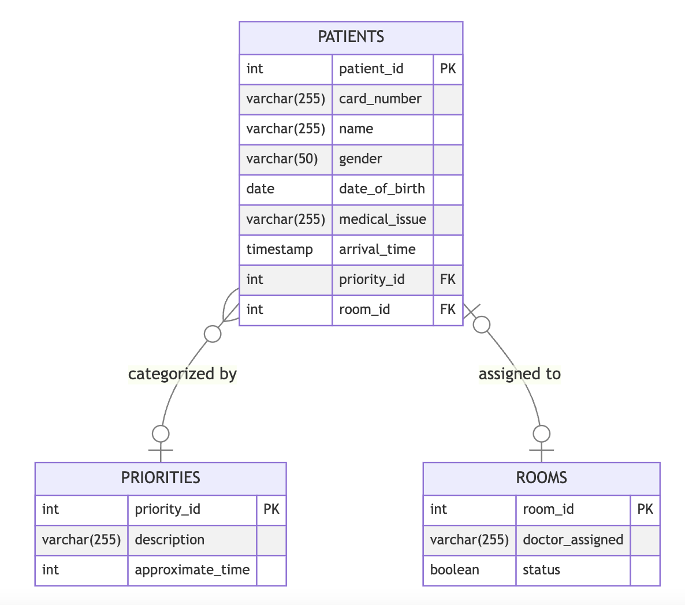

# Hospital Triage Database Design Documentation

## Entities Description

### Patients
This entity stores all relevant data about individuals seeking medical attention. It includes personal details and medical triage information.

### Priorities
This entity categorizes the urgency of patients' conditions. It assists in managing the flow of the triage process and helps prioritize care based on severity.

### Rooms
This entity contains details about the rooms available for patient care. It tracks the status of each room and the medical personnel assigned.

## Attributes Specification

### Patients Attributes:
- `patient_id` (integer): A unique identifier for each patient.
- `card_number` (varchar): The identification number on a patient's medical card.
- `name` (varchar): The full name of the patient.
- `gender` (varchar): The gender of the patient.
- `date_of_birth` (date): The birthdate of the patient.
- `medical_issue` (varchar): A description of the patient's medical issue.
- `arrival_time` (timestamp): The date and time when the patient arrived at the hospital.
- `priority_id` (integer): A reference to the Priorities entity, indicating the urgency of the patient's condition.
- `room_id` (integer): A reference to the Rooms entity, indicating the patient's assigned room (if any).

### Priorities Attributes:
- `priority_id` (integer): A unique identifier for the priority level.
- `description` (varchar): A verbal explanation of the priority level.
- `approximate_time` (integer): The estimated waiting time associated with each priority level.

### Rooms Attributes:
- `room_id` (integer): A unique identifier for each room.
- `doctor_assigned` (varchar): The name of the doctor assigned to the room.
- `status` (boolean): The occupancy status of the room; 'true' if occupied, 'false' if available.

## Database ERD (Entity-Relationship Diagram)

The ERD illustrates the relationships between entities. The `Patients` entity is connected to the `Priorities` and `Rooms` entities through foreign keys, indicating the relationship between a patient's urgency level and their room assignment.
